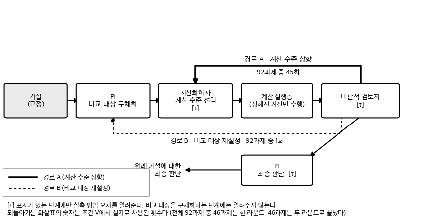
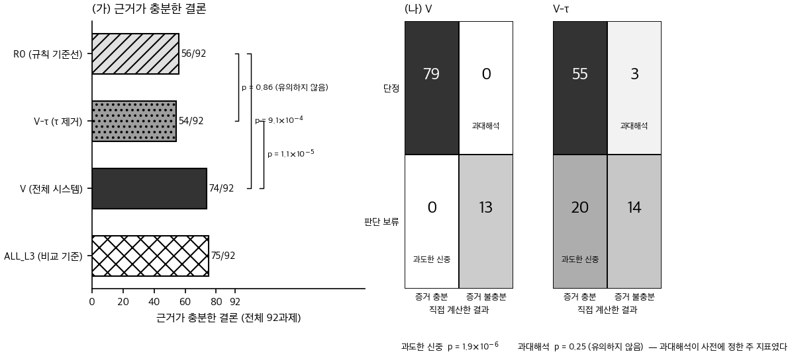
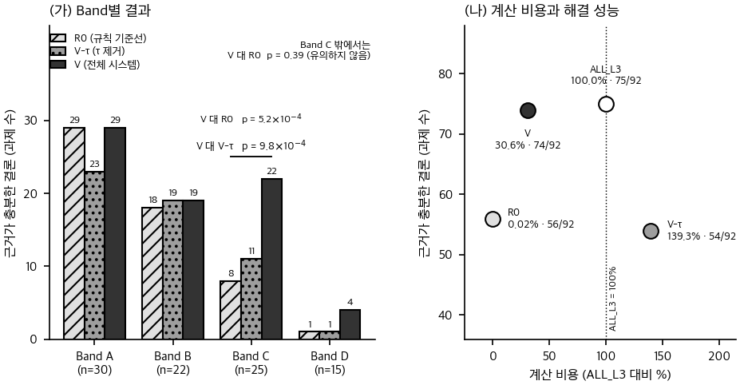

# 분자 계산으로 화학 가설을 자율 검증하는 AI 연구 에이전트

사람이 화학 가설을 문장으로 입력하면, AI 연구팀이 **실제 분자 계산을 수행하고**,
그 결과가 믿을 만한지 스스로 검토한 뒤, 필요하면 더 정밀한 계산으로 넘어가
최종 판단을 내리는 연구 시스템입니다.

- **만든 것** — 화학 가설을 받아 계산까지 스스로 설계·실행하고 결론을 내리는 3-에이전트 시스템
- **비교한 것** — 이 시스템에 *계산 방법의 오차 정보*를 준 조건과 뺀 조건, 그리고 LLM 없는 규칙 기준선
- **나온 것** — 오차 정보를 빼자 근거가 충분한 해결이 **74건에서 54건으로** 줄어, 규칙 기준선 56건과 통계적으로 구분되지 않았습니다

---

## 1. 왜 이 연구를 했나

AI가 계산을 돌려 숫자를 얻었다고 해서, 그 숫자를 그대로 믿어도 되는 것은 아닙니다.
**계산 방법 자체에 오차가 있기 때문입니다.**

체중계로 생각하면 쉽습니다. 오차가 ±1 kg인 체중계로 두 번을 쟀는데 0.3 kg 차이가
나왔다면, "늘었다"고 말할 수 없습니다. 그 차이는 저울의 오차 안에 있습니다.
분자 계산도 똑같습니다. 두 분자의 에너지 차이가 계산법의 오차보다 작다면,
어느 쪽이 더 안정한지 단정해서는 안 됩니다.

그런데 AI에게 계산 도구를 쥐여주면, 이 구분을 하지 않고 숫자가 나왔다는 이유만으로
결론을 내리기 쉽습니다. 그래서 이 연구는 이렇게 물었습니다.

> **AI에게 계산 결과뿐 아니라 "이 계산법은 원래 어느 정도 틀릴 수 있는가"라는
> 기준까지 함께 주면, 과학적 판단이 달라지는가?**

---

## 2. 무엇을 만들었나



세 개의 AI가 역할을 나눠 맡습니다.

| 역할 | 하는 일 |
|---|---|
| **PI** | 무엇을 검증할지 정리하고, 마지막에 지지·기각·**판단보류** 중 하나를 고른다 |
| **Computational Chemist** | 어떤 계산을 어느 정밀도로 돌릴지 결정한다 |
| **Skeptical Reviewer** | 지금 나온 증거로 결론을 내려도 되는지 검토한다 |

**숫자는 AI가 만들지 않습니다.** 실제 계산은 그 아래의 결정론적 실행층이 수행합니다.
실행층은 넘겨받은 계산 명세를 그대로 돌릴 뿐, 무엇을 비교할지도 어떤 결론을 낼지도
정하지 않습니다.

증거가 부족하다고 판단되면 두 갈래로 되돌아갑니다. **경로 A**는 계산 정밀도를 올리고,
**경로 B**는 원래 가설은 그대로 둔 채 비교 대상만 다시 정합니다.
92개 과제에서 경로 A는 45회, 경로 B는 1회 쓰였습니다.

---

## 3. 무엇을 비교했나

같은 92개 과제를 네 가지 방식으로 풀게 하고 결과를 짝지어 비교했습니다.

| 조건 | 무엇 |
|---|---|
| **V** | 위의 3-에이전트 시스템. 계산 오차 기준(τ)을 **알려준다** |
| **V−τ** | 완전히 같은 시스템에서 **오차 기준만 뺀다** |
| **R0** | LLM을 쓰지 않는 규칙 한 줄 기준선 |
| **ALL_L3** | 모든 과제를 무조건 고정밀 계산으로 처리하는 비교 기준 |

두 가지를 먼저 밝혀둡니다.

- **R0는 공정한 전면 비교 상대가 아닙니다.** R0는 비교할 구조 쌍·관측량·계산 수준을
  정답으로 받고 시작합니다. 따라서 **결론이 맞았는지의 축에서만** 비교할 수 있습니다.
- **ALL_L3는 도달 가능한 상한이 아닙니다.** 모든 과제를 비싸게 처리하는 하나의
  비교 정책일 뿐입니다.

---

## 4. 핵심 아이디어 — 방법 오차 τ

**τ는 이 계산법이 실제로 어느 정도 틀리는지를 벤치마크에서 측정한 경험적 오차 기준입니다.**
사람이 "적당히 작게" 정한 값이 아니라, 참조값과 대조해 실측한 값입니다.

τ가 있으면 채점이 기계적으로 됩니다. 에이전트가 "A가 B보다 안정하다"고 단정했을 때,
그 판단을 사람이나 다른 LLM이 평가하지 않습니다. **자기가 쓴 계산법의 오차보다 작은
차이를 놓고 단정했는가**로 판정합니다.

<details>
<summary><b>기술 세부 (계산화학 독자용)</b></summary>

- 참조값 **GMTKN55** 8개 서브셋 · **331 구조** · **224 반응**
- **L1** = GFN2-xTB · **L3** = B3LYP-D3(BJ)/def2-TZVP
- τ는 참조값 대비 실측 MAE이며, **반응 유형별**로 적용합니다 (서브셋별 MAE는 경계로 쓰지 않았습니다)

| 반응 유형 | 반응 | τ(L3) | τ(L1) | 사다리 |
|---|---:|---:|---:|---:|
| 배좌 이성질체 (conformer) | 167 | 0.405 | 1.213 | 3.0× |
| 구조 이성질체 (isomer) | 57 | 3.407 | 9.036 | 2.7× |

단위 kcal/mol. 계산 수준을 올리면 방법 오차가 줄어드는 것을 8개 서브셋 전부에서
확인했습니다. 그리고 **τ는 반응 유형에 따라 7.5~8.4배 차이가 납니다.**

과제 92개는 참조 에너지 차이 |ΔE|와 τ 사다리만으로 네 구간에 기계적으로 배정됩니다.
손으로 조정하지 않았습니다.

| 구간 | 조건 | 정답 행동 | 과제 |
|---|---|---|---:|
| A | \|ΔE\| > 3·τ(L1) | 낮은 수준으로 충분 | 30 |
| B | τ(L1) < \|ΔE\| ≤ 3·τ(L1) | 낮은 수준으로 충분 | 22 |
| **C** | τ(L3) < \|ΔE\| ≤ τ(L1) | **수준을 올려야 판단 가능** | 25 |
| D | \|ΔE\| ≤ τ(L3) | 어느 수준으로도 판단 불가 | 15 |

92과제는 **화학종이 중복되지 않으므로** 추론 단위와 과제 수가 같습니다.
설계 단계의 kill-gate 판정 전문은 [docs/D1_실측결과.md](docs/D1_실측결과.md)에 있습니다.

</details>

---

## 5. 가장 중요한 결과

### 근거가 충분한 결론 — 전체 92과제

*단정했고, 직접 계산한 차이가 그 계산법의 오차보다 컸으며, 방향이 참조값과 맞은 경우*

| ALL_L3 | **V** | R0 | **V−τ** |
|:---:|:---:|:---:|:---:|
| 75 | **74** | 56 | **54** |

**같은 시스템에서 계산 오차 정보만 제거하자 74건에서 54건으로 줄었고 (p = 1.1×10⁻⁵),
규칙 기준선 56건과 통계적으로 구분되지 않았습니다 (p = 0.86).**

**비용** — 모든 과제를 고정밀로 처리한 ALL_L3가 75과제를 해결한 데 비해,
V는 74과제를 **계산비용 30.65%로** 해결했습니다.

### ❗ 원래의 주 지표에서는 차이가 없었습니다

이 연구가 사전에 정해둔 주 지표는 **과대해석 감소**였습니다.
결과는 **V 0/92 · V−τ 3/92 · p = 0.25** 로, 두 조건이 갈리지 않았습니다.

**p값에 대하여.** 위 p값들은 **결과를 확인한 뒤 추가한 사후 분석**입니다.
사전에 정해져 있던 것은 주 지표(과대해석)와 주 비교축(V 대 V−τ)이었고,
정확 McNemar 검정을 쓴다는 계획은 사전등록에 없었습니다. 다중비교 보정도 하지
않았습니다. 검정 8건의 지위 구분은 [보충자료 표 S1](tables/supplementary/S1_tests.md)에
있습니다.



---

## 6. 예상과 달랐던 점

처음에는 방법 오차 정보가 **AI의 성급한 결론(과대해석)을 줄일 것**으로 예상했습니다.
그런데 그 효과는 통계적으로 뚜렷하지 않았습니다 (p = 0.25).

대신 반대편에서 큰 차이가 나타났습니다. **오차 정보가 없는 조건에서는, 충분한 근거가
있는데도 결론을 보류하는 «과도한 신중»이 크게 늘었습니다** — V 0건 대 V−τ 20건.

즉 오차 기준은 성급함을 막는 쪽보다, **판단할 수 있을 때 판단하게 하는 쪽**으로
작동한 것으로 보입니다. 다만 이 지표는 사전에 정해둔 것이 아니므로 탐색적 결과입니다.

---

## 7. 어디에서 차이가 나타났나

**Band C**는 값싼 계산으로는 판단하기 어렵지만 더 정밀한 계산으로는 판단할 수 있는
문제들입니다. 계산 정밀도를 올리는 것이 정답 행동을 바꾸는 유일한 구간입니다.

| Band C (25과제) | V | V−τ | R0 |
|---|---:|---:|---:|
| 근거가 충분한 결론 | **22** | 11 | 8 |

**통계적으로 검출된 성능 이득은 Band C에 집중되었습니다.** Band C 밖에서는
V와 R0의 차이가 검출되지 않았는데(p = 0.39), 이는 차이가 없다는 뜻이 아니라
**차이가 검출되지 않았다**는 뜻입니다.



---

## 8. 비교할 구조도 스스로 찾았나

가설 문장만 주고 "무엇과 무엇을 비교할지"를 에이전트가 직접 특정하게 했습니다.

| | 정확도 |
|---|---|
| 본실행 자율 식별 | 76 / 76 |
| 식별 챌린지 primary | 24 / 24 |
| 보충 관측 secondary | 94 / 94 |

**이 숫자는 다음 조건에서 읽어야 합니다.**

- **천장 효과** — 전부 만점이라 조건 간 비교가 불가능합니다.
- **추론 검정은 primary 24에서만** 했습니다. 그 분석계획도 원 기획안의 사전등록이
  아니라 **실행 직전에 확정한 것**입니다. 또 24개 중 15개가 한 서브셋(Amino20x4)에서
  나와, 다른 화학 계열로 일반화된다고 주장하지 않습니다.
- **secondary 94는 화학종 24종에서 나온 94개 관측**이며, 독립 표본 94개가 아닙니다.
  **replication이 아니고**, 새 p값이나 신뢰구간을 붙이지 않았습니다.

---

## 9. 현재 상태

| | |
|---|---|
| 본실행 N=92 | ✅ 완료 (FAILED 0/92) |
| 식별 챌린지 primary 24 | ✅ 완료 |
| 보충 관측 secondary 94 | ✅ 완료 (탐색적) |
| Figure F0~F4 | 🔒 LOCK |
| Main Table 1 | 🔒 LOCK |
| Supplementary S1~S8 | 🔒 LOCK |
| Supplementary S9 (다른 베이스 모델 보조 검증) | 🔒 LOCK (S1~S8과 별도 기록) |
| 다른 베이스 모델 보조 검증 | ✅ 30 / 30 완료 |
| 논문 본문 | 🔲 미시작 |

`🔒 LOCK` 은 수치·문구를 더 이상 바꾸지 않기로 확정했다는 뜻입니다.
상세 진행 상황은 [RESUME_HERE.md](RESUME_HERE.md)에 있습니다.

**다른 베이스 모델에서의 보조 검증(30과제, 실패 0).** 같은 시스템을 베이스 모델만 바꿔
다시 돌렸습니다. 실행 전에 정해 둔 기준은 «규칙 기준선보다 근거가 충분한 결론이 많은가»
하는 **방향 하나**였고, 그 기준은 충족됐습니다(21/30 대 18/30). **다만 그 차이는
통계적으로 유의하지 않았고**(p = 0.453), 오차 정보를 뺀 조건은 이 모델에서 돌리지
않았습니다 — 따라서 **오차 정보의 효과가 모델을 넘어 일반화된다는 주장은 하지 않습니다.**
주 결과를 대체하거나 확증하는 실험이 아닙니다.
→ [보충자료 표 S9](tables/supplementary/S9_replication.md)

**시스템 이름은 아직 확정하지 않았습니다.** 코드 네임스페이스에 남아 있는 `vccl`은
작업명입니다.

2026-08-08 시작 · 마감 2026-09-02 · 단독 진행 · Apple M4 (GPU·웻랩 없음)

---

## 10. 처음 방문했다면 여기부터

**결과를 빠르게 보고 싶다면**
- [figures/draft/](figures/draft/) — Figure F0~F4 · [설명문](figures/captions.md)
- [tables/draft/T1_system.md](tables/draft/T1_system.md) — Main Table 1
- [tables/supplementary/](tables/supplementary/) — 보충자료 표 S1~S8
- [tables/supplementary/S9_replication.md](tables/supplementary/S9_replication.md) — 표 S9: 다른 베이스 모델에서의 보조 검증

**주장과 근거를 확인하고 싶다면**
- [paper_logic/new_fol.md](paper_logic/new_fol.md) — 주장 사슬과 각 주장에 붙은 근거·금지 표현
- [paper_logic/claim_evidence_map.md](paper_logic/claim_evidence_map.md) — 주장–증거 대응표와 한계 L1~L8

**연구 결정과 정정 이력을 보고 싶다면**
- [docs/DECISION_LOG.md](docs/DECISION_LOG.md) — 모든 설계 결정·수정·사고 기록 (정정 이력 포함)
- [docs/D1_실측결과.md](docs/D1_실측결과.md) — τ 실측 전문과 설계 단계 게이트 판정
- [docs/기획안_v3.md](docs/기획안_v3.md) — 연구 설계

**직접 재현하고 싶다면**
- [docs/REPRODUCIBILITY.md](docs/REPRODUCIBILITY.md) — 환경·실행 명령·코드 구조
- [tables/supplementary/LOCK_MANIFEST.md](tables/supplementary/LOCK_MANIFEST.md) — LOCK 산출물 sha256 대장 (S1~S8)
- [tables/supplementary/S9_LOCK.md](tables/supplementary/S9_LOCK.md) — 표 S9의 별도 LOCK 기록

**현재 개발 상태**
- [RESUME_HERE.md](RESUME_HERE.md) — 지금 어디까지 왔고 다음에 무엇을 하는지
- [CLAUDE.md](CLAUDE.md) — 개발·운영 지침 (internal project instructions). 연구 프로토콜이나
  동결 문서가 아니라, 작업 방식과 지켜야 할 제약을 적어둔 내부 문서입니다.

---

## 11. 재현

이 연구의 설계 원칙은 두 가지로 요약됩니다. **주 지표를 LLM이 채점하지 않는다**는 것과,
**τ·라벨·과제는 결과를 보기 전에 동결하고 이후 수정하지 않는다**는 것입니다.
전문은 [CLAUDE.md](CLAUDE.md)에 있습니다.

동결이 실제로 지켜졌는지는 명령으로 확인할 수 있습니다. **셋 다 LLM/API를 호출하지
않습니다.**

```bash
# 동결 해시·과제 커버리지·원장 무결성 23항목
python3 src/vccl/scoring/aggregate.py --check

# LOCK 된 표·그림 산출물의 sha256 대조
python3 tables/lock_manifest.py --verify

# 동결본 → 데이터 → 그림 재생성 (수치를 손으로 옮겨 적지 않는다)
python3 src/vccl/scoring/plot_data.py && python3 figures/make_figures.py
```

환경 구성, 계산 재현(GMTKN55 내려받기·xTB·psi4 실행), 코드 구조는
[docs/REPRODUCIBILITY.md](docs/REPRODUCIBILITY.md)에 있습니다.
