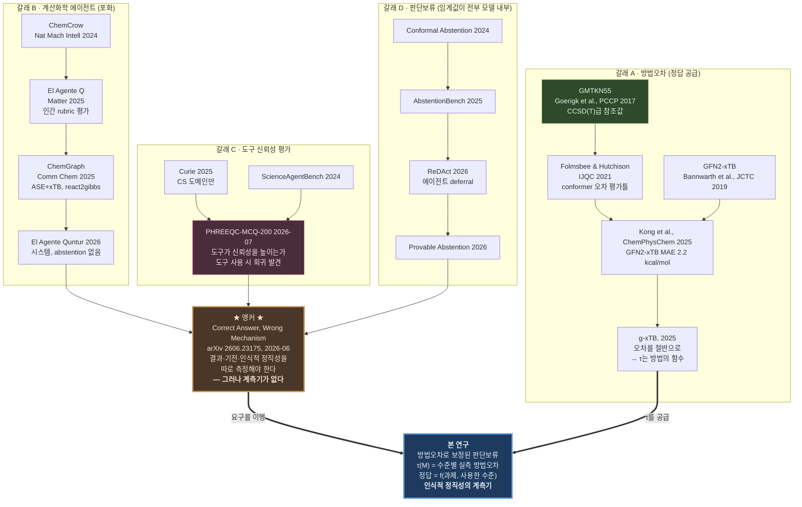

# 선행연구 조사 및 계보

**조사일 2026-08-08.** 확정된 기획안 v3를 백지에서 읽고, 문서가 실제로 주장하는 것에서
출발해 역으로 계보를 찾았다. 사전에 앵커를 정해두고 맞춰넣지 않았다.

---

# 0. 기획안이 실제로 주장하는 것 (계보 탐색의 출발점)

문서를 처음 보는 것으로 읽으면 주장이 셋으로 분해된다.

1. **AI 에이전트가 실제 양자화학 계산을 실행하고 결론을 낸다.** → 시스템 계보
2. **그 결론이 정당한지는 "증거가 방법오차보다 큰가"로 판정된다.** → 방법오차 계보
3. **그리고 이 판정은 사람이나 LLM 없이 결정된다.** → 판단보류·인식적 정직성 계보

따라서 찾아야 할 갈래는 네 개다. 시스템 / 방법오차 / 평가 / 판단보류.

---

# 1. 갈래 A — 계산화학 방법오차 (정답을 공급하는 계보)

이 갈래가 논문의 **정답 근거**를 댄다.

| 논문 | 기여 | 본 연구와의 관계 |
|---|---|---|
| **Goerigk, Hansen, Bauer, Ehrlich, Najibi, Grimme**, "A look at the density functional theory zoo with the advanced GMTKN55 database", *PCCP* **19**, 32184 (2017) | 55개 서브셋, 1,505개 상대에너지, CCSD(T)급 참조값 | **참조 데이터 그 자체.** τ의 분모 |
| **Bannwarth, Ehlert, Grimme**, "GFN2-xTB", *JCTC* **15**, 1652 (2019) | 평가 대상 semiempirical 방법 | L2의 정의 |
| **Folmsbee & Hutchison**, "Assessing conformer energies using electronic structure and machine learning methods", *Int. J. Quantum Chem.* **121**, e26381 (2021) | 708세트 × 10 conformer, DLPNO-CCSD(T) 기준 | conformer 상대에너지 오차의 표준 평가틀 |
| **Kong et al.**, "Discriminating High from Low Energy Conformers of Druglike Molecules", *ChemPhysChem* (2025), 10.1002/cphc.202400992 | **GFN2-xTB MAE 2.2 kcal/mol, Kendall τ 0.63** | τ₂의 문헌 기대값. 우리는 이를 빌리지 않고 직접 측정하되, 실측치의 타당성 검증에 쓴다 |
| **ConfRank** (*JCIM* **64**, 8909, 2024) / **ConfRank+** (*JCIM* **65**, 8664, 2025) | conformer 순위 개선 학습 | 순위 정확도가 활발한 문제라는 근거 |
| **g-xTB** (ChemRxiv 2025, 10.26434/chemrxiv-2025-bjxvt) | GFN2-xTB 오차를 약 절반으로 | τ가 방법의 함수임을 보여주는 직접 증거 |

## 여기서 확인된 중요한 사실 — 개념 자체는 새롭지 않다

계산화학에서 **"에너지 차이가 방법오차 안에 있으면 순위를 주장할 수 없다"는 인식은 이미
존재한다.** 검색 중 확인된 표현: conformer 에너지차가 흔히 1~2 kcal/mol이고 이는
B3LYP-D3(BJ) 자체의 방법오차 범위 안이라는 서술.

**따라서 본 연구의 신규성은 "우리가 방법오차의 중요성을 발견했다"가 아니다.**
그 인식을 **AI 에이전트의 판단보류 기준으로 조작화하고, 에이전트가 그것을 지키는지 측정한
것**이 신규성이다. 논문에서 이 구분을 명시해야 한다. 흐리면 계산화학자 심사자가
"우리가 늘 알던 것 아닌가"라고 반박한다.

---

# 2. 갈래 B — 계산화학 에이전트 (시스템 계보, 이미 포화)

| 논문 | 기여 | 판정 |
|---|---|---|
| **ChemCrow** (Bran et al., *Nat. Mach. Intell.* 2024) | 18개 화학 도구 + GPT-4 | 도구 사용 시연의 원형 |
| **El Agente Q** (arXiv 2505.02484, *Matter* 2025) | ORCA+xTB, 20+ 도메인 에이전트, 대학 과제 87%+ | **평가가 인간 전문가 rubric 100점.** abstention 없음 |
| **ChemGraph** (arXiv 2506.06363, *Comm. Chem.* 2025) | ASE + TBLite/xTB, `react2enthalpy`·`react2gibbs`, 13태스크/360인스턴스 | **파이프라인 기여를 선점.** 우리가 파이프라인을 기여로 주장할 수 없는 이유 |
| **El Agente Quntur** (arXiv 2602.04850) | ORCA 6.0, 계층적 다중에이전트, 문헌·문서 통합 | **시스템이며 벤치마크가 아님. abstention·불확실성 미평가** (초록 직접 확인) |
| **El Agente Gráfico** (arXiv 2602.17902) | 구조화된 실행 그래프 | 실행 계보 |
| **QUASAR** (arXiv 2602.00185, *JCIM* 2026) | 3단계 난이도 태스크 | |
| **ChemReasoner** (arXiv 2402.10980) | 양자화학 피드백으로 LLM 지식공간 탐색 | 계산 피드백 루프의 선례 |

**결론: 이 갈래에서 우리가 새로 기여할 것은 없다.** 최소 7개 시스템이 자연어→양자화학
계산을 이미 한다. 기획안 §2가 "파이프라인 신규성 0"이라고 못 박은 것이 옳다.

---

# 3. 갈래 C — 도구 쓰는 과학 에이전트의 신뢰성 평가 (가장 가까운 평가 계보)

| 논문 | 기여 | 우리와의 거리 |
|---|---|---|
| **PHREEQC-MCQ-200** (arXiv 2607.00436, 2026-07-01) | PHREEQC 지구화학 시뮬레이터, 21시나리오 → 200문항 객관식. **도구 접근이 신뢰성을 높이는가**를 측정하고, **도구를 쓰면 오히려 나빠지는 회귀**를 발견 | **가장 가까운 평가 논문.** 다만 객관식이고 판단보류·시뮬레이터 한계 인식을 다루지 않음 (초록 직접 확인) |
| **arXiv 2606.26346** | 도구 증강 에이전트의 실세계 에너지 분석 과제 성능 | "도구 증강 에이전트를 만드는 것은 일상이 되었으나, 도구가 실제로 신뢰성을 높이는지 평가하는 것은 아니다"라는 문제의식 |
| **Curie** (arXiv 2502.16069) | 엄격하고 자동화된 실험 | 46문항이 **CS 4개 도메인뿐.** 계산화학 미포함 |
| **ScienceAgentBench** (arXiv 2410.05080) | 102태스크, 계산화학 포함 | 코드 산출물 정답 대조. abstention 미평가 |
| **EXP-Bench** (arXiv 2505.24785) | AI 논문 실험 461태스크 | 계산화학 미포함 |

**여기가 본 연구의 자리다.** 이 계보는 "도구가 신뢰성을 높이는가"를 묻기 시작했지만,
**"에이전트가 도구의 한계를 아는가"는 아직 아무도 측정하지 않았다.**

---

# 4. 갈래 D — 판단보류·선택적 예측 (방법 계보)

| 논문 | 임계값의 출처 |
|---|---|
| **AbstentionBench** (arXiv 2506.09038) | 태스크 모호성 |
| **ReDAct: Uncertainty-Aware Deferral for LLM Agents** (arXiv 2604.07036) | 모델 불확실성 |
| **Uncertainty-Aware Abstention with Provable Alignment Guarantees** (arXiv 2607.04430) | 신뢰구간 기반 보정 |
| **Entropy Alone is Insufficient for Safe Selective Prediction** (arXiv 2603.21172) | 엔트로피의 한계 지적 |
| **Conformal Abstention** (arXiv 2405.01563) | conformal calibration |
| **Abstention-Aware Scientific Reasoning** (arXiv 2602.14189) | 모델 confidence (SciFact/PubMedQA) |
| **Cost-Saving LLM Cascades with Early Abstention** (arXiv 2502.09054) | 비용-정확도 |

**공통점: 임계값이 전부 모델 내부에서 나온다.** 신뢰도, 엔트로피, conformal, 태스크 모호성.
**물리적 계측기의 오차에서 나온 사례가 없다.**

이것이 기획안 §2의 arXiv 검색 결과(`abstention AND quantum chemistry` 0건)와 일치한다.

---

# 5. 갈래 E — 인식적 정직성 (직전 논문, 그리고 앵커 후보)

**arXiv 2606.23175 — "Position: Correct Answer, Wrong Mechanism — When AI Scientists
Defend General Claims Their Own Data Contradicts" (2026-06)**

- Geant4 입자물리 시뮬레이션에서 코딩 에이전트가 알려진 관측량을 재발견하게 함
- 28 에피소드. primary 20개 중 4개, cross-model 8개 중 3개에서 **CAWM**(맞아 보이는 결과를
  틀린 추론으로 도달, 조건이 바뀌면 깨짐)
- 부분적으로 오도하는 사전정보를 주자 다섯 에이전트 모두 거짓 성분은 증거로 기각했으나,
  **하나는 자기 데이터와 모순되는 물리로 자기 선택을 방어**
- 핵심 주장: **결과만 보는 평가는 불충분하며, 과제 결과·기전 충실도·인식적 정직성을
  따로 측정해야 한다**

## 이것이 앵커다

세 가지 이유로 이 논문이 앵커여야 한다.

1. **주장이 우리 논문의 전제와 정확히 같다.** "결과가 맞았다고 정당한 것이 아니다"는
   기획안 §3.1의 "방향이 맞았으니 정답이 아니다"와 동일 명제다.
2. **그런데 계측기가 없다.** Position paper이고 28 에피소드의 정성 관찰이다.
   "인식적 정직성을 측정해야 한다"고 주장하지만 **무엇을 기준으로 측정할지 제시하지 않는다.**
3. **우리가 그 계측기를 만든다.** 방법오차 τ는 인식적 정직성을 사람 판단 없이
   결정 가능한 양으로 바꾼다. 즉 앵커의 요구를 이행하는 관계다.

Curie를 앵커로 두지 않는 이유: Curie는 실험 절차의 엄격성을 다루지만 46문항이 CS 도메인이고,
결론의 **강도**를 증거와 연결하는 축이 없다. 우리 주장과 접점이 2606.23175보다 멀다.

---

# 6. 계보도

---

# 7. 논리 전개 — 왜 이 논문이 필요한가

여섯 문장으로 이어진다.

1. **계산화학 에이전트는 이미 많다.** ChemCrow → El Agente Q → ChemGraph → Quntur.
   자연어에서 양자화학 계산까지 자동으로 간다.
2. **그런데 평가는 인간 rubric이나 최종 정답 일치에 머문다.** El Agente Q는 전문가 100점
   rubric, ScienceAgentBench는 코드 산출물 대조다.
3. **최근 이것이 불충분하다는 증거가 나왔다.** PHREEQC-MCQ-200은 도구를 주면 오히려
   나빠지는 회귀를 발견했고, arXiv 2606.23175는 맞는 답을 틀린 기전으로 내는 CAWM을 관찰했다.
4. **2606.23175는 인식적 정직성을 따로 측정하라고 요구한다. 그러나 기준을 주지 않는다.**
   무엇에 비추어 "정직하지 않다"고 할 것인가?
5. **계산화학에는 그 기준이 이미 있다.** 방법오차다. GMTKN55 참조값 대비 MAE로 측정되고,
   계산 수준을 올리면 줄어든다(g-xTB가 GFN2-xTB의 절반).
6. **따라서 인식적 정직성은 계산화학에서 결정 가능한 양이 된다.**
   증거가 τ(사용한 수준)보다 작은데 단정했는가. 이것이 본 연구의 계측기다.

---

# 8. 논문에서 반드시 인용하고 구분해야 할 것

| 논문 | 반드시 써야 할 문장 |
|---|---|
| ChemGraph, El Agente Q | "파이프라인은 우리 기여가 아니다. 이들이 이미 한다." |
| Kong et al. 2025 | "GFN2-xTB conformer MAE는 문헌상 2.2 kcal/mol이며, 우리는 이를 빌리지 않고 우리 쌍 분포에서 직접 측정한다." |
| 계산화학 통념 | "에너지차가 방법오차 안이면 순위를 주장할 수 없다는 것은 계산화학의 상식이다. 새로운 것은 이를 에이전트 판단보류의 기준으로 조작화하고 준수 여부를 측정한 것이다." |
| PHREEQC-MCQ-200 | "도구가 신뢰성을 높이는가를 물었다. 우리는 에이전트가 도구의 한계를 아는가를 묻는다." |
| 2606.23175 (앵커) | "인식적 정직성을 따로 측정하라고 요구했다. 우리는 그 계측기를 제시한다." |
| 판단보류 계보 전체 | "이들의 임계값은 모두 모델 내부에서 나온다. 우리 것은 물리 계측기의 오차에서 나온다." |

---

# 9. 확인 못 한 것

- Kong et al. ChemPhysChem 2025 본문 (페이월). MAE 2.2 / Kendall τ 0.63은 검색 스니펫 수준
- GMTKN55 참조값의 ZPVE-exclusive 여부 (원문 SI 미확인)
- PHREEQC-MCQ-200 본문 (초록만 확인). abstention 미평가는 초록 기준 판단
- El Agente Quntur 본문 (초록만 확인)
- arXiv 2606.23175 본문 전체 (초록·HTML 요약 수준)
- ConfRank / ConfRank+ 본문
- 갈래 D 논문 대부분은 제목·초록 수준

**Sources:**
[GMTKN55/DFT zoo](https://onlinelibrary.wiley.com/doi/10.1002/qua.26381) ·
[Folmsbee & Hutchison IJQC 2021](https://onlinelibrary.wiley.com/doi/10.1002/qua.26381) ·
[Kong et al. ChemPhysChem 2025](https://chemistry-europe.onlinelibrary.wiley.com/doi/10.1002/cphc.202400992) ·
[GFN2-xTB JCTC 2019](https://pubs.acs.org/jctcce/article/15/3/1652/975266/GFN2-xTB-amp-xe5f8-An-Accurate-and-Broadly) ·
[g-xTB ChemRxiv](https://chemrxiv.org/doi/pdf/10.26434/chemrxiv-2025-bjxvt) ·
[ConfRank JCIM](https://pubs.acs.org/jcisd8/article-abstract/64/23/8909/850597/ConfRank-Improving-GFN-FF-Conformer-Ranking-with) ·
[El Agente Q Matter](https://www.cell.com/matter/fulltext/S2590-2385(25)00306-6) ·
[ChemGraph Comm Chem](https://www.nature.com/articles/s42004-025-01776-9_reference.pdf) ·
[El Agente Quntur](https://arxiv.org/pdf/2602.04850) ·
[El Agente Gráfico](https://arxiv.org/pdf/2602.17902) ·
[PHREEQC-MCQ-200](https://arxiv.org/pdf/2607.00436) ·
[Tool-augmented agents energy analytics](https://arxiv.org/pdf/2606.26346) ·
[Correct Answer Wrong Mechanism](https://arxiv.org/abs/2606.23175) ·
[ReDAct](https://arxiv.org/html/2604.07036v1) ·
[Uncertainty-Aware Abstention](https://arxiv.org/html/2607.04430v1) ·
[Entropy Insufficient](https://arxiv.org/pdf/2603.21172) ·
[ChemReasoner](https://arxiv.org/pdf/2402.10980)
